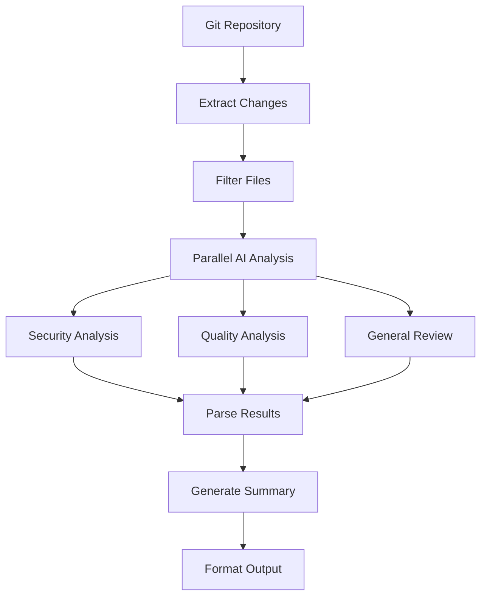

# Technical Architecture Guide

## System Overview

The AI-Powered Code Review Assistant is built using a layered architecture that promotes separation of concerns, testability, and maintainability. This document provides deep technical insights into each architectural component.

## Architecture Patterns

### 1. Dependency Injection Pattern
```csharp
// Service Registration
services.AddTransient<ILlmService, LlmService>();
services.AddTransient<IGitService, GitService>();
services.AddTransient<ICodeReviewService, CodeReviewService>();
```

**Benefits:**
- Loose coupling between components
- Easy unit testing with mocks
- Runtime service resolution
- Configuration-driven implementations

### 2. Repository Pattern (Git Operations)
```csharp
public interface IGitService
{
    Task<IEnumerable<FileDiff>> GetChangesAsync(string repoPath, string commitHash);
    // Abstract Git operations behind clean interface
}
```

**Benefits:**
- Abstracts Git complexity
- Enables testing without real repositories
- Consistent data access patterns

### 3. Strategy Pattern (Output Formatting)
```csharp
var content = format.ToLowerInvariant() switch
{
    "json" => FormatJson(result),
    "html" => FormatHtml(result),
    "markdown" => FormatMarkdown(result),
    _ => FormatJson(result)
};
```

**Benefits:**
- Pluggable output formats
- Easy to add new formats
- Runtime format selection

## Layer Architecture

```
┌─────────────────────────────────────┐
│              CLI Layer              │ ← User Interface
├─────────────────────────────────────┤
│           Service Layer             │ ← Business Logic
├─────────────────────────────────────┤
│          Integration Layer          │ ← External APIs
├─────────────────────────────────────┤
│            Data Layer               │ ← File System/Git
└─────────────────────────────────────┘
```

### CLI Layer Components

#### Command Parser
```csharp
[Verb("review-commit", HelpText = "Review a specific git commit")]
public class ReviewCommitOptions
{
    [Option('r', "repo", Required = true, HelpText = "Path to the git repository")]
    public string RepoPath { get; set; } = string.Empty;
    // ...
}
```

**Responsibilities:**
- Parse command-line arguments
- Validate input parameters
- Route to appropriate handlers
- Format and display output

#### Output Formatters
```csharp
public static class OutputFormatter
{
    public static async Task WriteOutputAsync(ReviewResult result, string? outputPath, string format)
    {
        // Format selection and output generation
    }
}
```

**Responsibilities:**
- Multi-format output generation (JSON, HTML, Markdown)
- File I/O operations
- Console output formatting

### Service Layer Components

#### Code Review Service (Orchestrator)
```csharp
public class CodeReviewService : ICodeReviewService
{
    public async Task<ReviewResult> ReviewCommitAsync(string repoPath, string commitHash)
    {
        // Orchestrate the review process
        var changes = await _gitService.GetChangesAsync(repoPath, commitHash);
        var reviews = await ProcessChangesAsync(changes);
        return new ReviewResult { Reviews = reviews, Summary = GenerateSummary(reviews) };
    }
}
```

**Responsibilities:**
- Coordinate between Git and LLM services
- Implement business logic for reviews
- Generate summaries and statistics
- Error handling and logging

#### LLM Service (AI Integration)
```csharp
public class LlmService : ILlmService
{
    public async Task<string> ReviewCodeAsync(string code, string context, string fileName)
    {
        var prompt = BuildReviewPrompt(code, context, fileName);
        return await CallOpenAIAsync(prompt);
    }
}
```

**Responsibilities:**
- OpenAI API integration
- Prompt engineering and optimization
- Response parsing and formatting
- Rate limiting and error handling

#### Git Service (Repository Operations)
```csharp
public class GitService : IGitService
{
    public async Task<IEnumerable<FileDiff>> GetChangesAsync(string repoPath, string commitHash)
    {
        using var repo = new Repository(repoPath);
        // Process Git operations
    }
}
```

**Responsibilities:**
- Git repository interactions
- Diff generation and analysis
- File content retrieval
- Commit metadata extraction

## Data Flow Architecture

### 1. Request Processing Flow
```
User Input → CLI Parser → Validation → Service Routing → Business Logic → External APIs → Response Formatting → Output
```

### 2. Code Review Flow


### 3. Error Handling Flow
```csharp
try
{
    var result = await _service.ProcessAsync(input);
    return result;
}
catch (GitException ex)
{
    _logger.LogError(ex, "Git operation failed");
    return ErrorResult.GitError(ex.Message);
}
catch (OpenAIException ex)
{
    _logger.LogError(ex, "AI analysis failed");
    return ErrorResult.AIError(ex.Message);
}
catch (Exception ex)
{
    _logger.LogError(ex, "Unexpected error");
    return ErrorResult.UnknownError();
}
```

## Performance Considerations

### 1. Async/Await Pattern
```csharp
// Parallel processing for efficiency
var tasks = changes.Select(change => ProcessChangeAsync(change));
var results = await Task.WhenAll(tasks);
```

### 2. Resource Management
```csharp
// Proper disposal of Git repositories
using var repo = new Repository(repoPath);
// Repository automatically disposed
```

### 3. Caching Strategy
```csharp
// Future implementation: Cache AI responses
private readonly IMemoryCache _cache;

public async Task<string> GetCachedAnalysisAsync(string codeHash)
{
    return await _cache.GetOrCreateAsync(codeHash, async factory =>
    {
        return await _llmService.AnalyzeAsync(code);
    });
}
```

## Security Architecture

### 1. API Key Management
```csharp
// Multiple sources for API key configuration
var apiKey = configuration["OpenAI:ApiKey"] ??
             Environment.GetEnvironmentVariable("OPENAI_API_KEY");

if (string.IsNullOrEmpty(apiKey))
{
    // Graceful degradation without exposing errors
    _logger.LogWarning("API key not configured");
}
```

### 2. Input Validation
```csharp
private bool ShouldSkipFile(string filePath)
{
    // Prevent processing of potentially dangerous files
    var skipExtensions = new[] { ".exe", ".dll", ".bin", ".obj" };
    var skipDirectories = new[] { "bin", "obj", "node_modules", ".git" };

    return IsUnsafeFile(filePath, skipExtensions, skipDirectories);
}
```

### 3. Path Sanitization
```csharp
public bool IsValidPath(string path)
{
    try
    {
        var fullPath = Path.GetFullPath(path);
        // Ensure path is within allowed boundaries
        return IsWithinAllowedDirectory(fullPath);
    }
    catch (Exception)
    {
        return false;
    }
}
```

## Extensibility Points

### 1. New Analysis Types
```csharp
public interface ILlmService
{
    Task<string> ReviewCodeAsync(string code, string context, string fileName);
    Task<string> AnalyzeSecurityVulnerabilitiesAsync(string code, string fileName);
    Task<string> CheckCodeQualityAsync(string code, string fileName);
    // Easy to add: Task<string> AnalyzePerformanceAsync(string code, string fileName);
}
```

### 2. New Output Formats
```csharp
var content = format.ToLowerInvariant() switch
{
    "json" => FormatJson(result),
    "html" => FormatHtml(result),
    "markdown" => FormatMarkdown(result),
    "xml" => FormatXml(result),      // Easy to add
    "csv" => FormatCsv(result),      // Easy to add
    _ => FormatJson(result)
};
```

### 3. New CLI Commands
```csharp
// Add new verb for specialized operations
[Verb("analyze-performance", HelpText = "Analyze code performance")]
public class AnalyzePerformanceOptions
{
    // New command structure
}
```

## Testing Architecture

### 1. Unit Testing Strategy
```csharp
public class GitServiceTests
{
    private readonly Mock<ILogger<GitService>> _mockLogger;
    private readonly GitService _gitService;

    public GitServiceTests()
    {
        _mockLogger = new Mock<ILogger<GitService>>();
        _gitService = new GitService(_mockLogger.Object);
    }

    [Test]
    public async Task GetChangesAsync_ValidCommit_ReturnsChanges()
    {
        // Arrange, Act, Assert
    }
}
```

### 2. Integration Testing
```csharp
public class IntegrationTests
{
    private readonly TestFixture _fixture;

    [Test]
    public async Task EndToEndReview_WithTestRepository_ReturnsResults()
    {
        // Test entire pipeline with real Git repository
        var result = await _codeReviewService.ReviewCommitAsync(testRepo, testCommit);
        Assert.That(result.Reviews.Count, Is.GreaterThan(0));
    }
}
```

### 3. Mock Strategies
```csharp
// Mock external dependencies
var mockLlmService = new Mock<ILlmService>();
mockLlmService.Setup(x => x.ReviewCodeAsync(It.IsAny<string>(), It.IsAny<string>(), It.IsAny<string>()))
              .ReturnsAsync("Mock analysis result");

var mockGitService = new Mock<IGitService>();
mockGitService.Setup(x => x.GetChangesAsync(It.IsAny<string>(), It.IsAny<string>()))
              .ReturnsAsync(GetTestFileDiffs());
```

## Monitoring and Observability

### 1. Structured Logging
```csharp
_logger.LogInformation("Starting review of commit {CommitHash} in {RepoPath}",
                      commitHash, repoPath);

_logger.LogError(ex, "Error analyzing file {FilePath} with {ErrorType}",
                filePath, ex.GetType().Name);
```

### 2. Performance Metrics
```csharp
var stopwatch = Stopwatch.StartNew();
try
{
    var result = await ProcessAsync();
    _logger.LogInformation("Review completed in {Duration}ms", stopwatch.ElapsedMilliseconds);
    return result;
}
finally
{
    stopwatch.Stop();
}
```

### 3. Health Checks
```csharp
public class HealthCheckService
{
    public async Task<HealthStatus> CheckOpenAIConnectivity()
    {
        try
        {
            await _openAiClient.GetModelsAsync();
            return HealthStatus.Healthy;
        }
        catch (Exception ex)
        {
            return HealthStatus.Unhealthy($"OpenAI API unreachable: {ex.Message}");
        }
    }
}
```

## Configuration Management

### 1. Hierarchical Configuration
```json
{
  "OpenAI": {
    "ApiKey": "",
    "Model": "gpt-4",
    "MaxTokens": 4000,
    "Temperature": 0.1
  },
  "CodeReview": {
    "MaxFileSizeBytes": 1048576,
    "ParallelProcessing": true,
    "TimeoutSeconds": 300
  }
}
```

### 2. Environment-Specific Settings
```csharp
.AddJsonFile("appsettings.json", optional: false)
.AddJsonFile($"appsettings.{environment}.json", optional: true)
.AddEnvironmentVariables()
.AddUserSecrets<Program>() // For development
```

### 3. Validation
```csharp
public class OpenAIOptions
{
    public string ApiKey { get; set; } = string.Empty;
    public string Model { get; set; } = "gpt-4";

    public void Validate()
    {
        if (string.IsNullOrEmpty(ApiKey))
            throw new InvalidOperationException("OpenAI API key is required");
    }
}
```

## Deployment Architecture

### 1. Single Executable Deployment
```xml
<PropertyGroup>
    <PublishSingleFile>true</PublishSingleFile>
    <SelfContained>true</SelfContained>
    <RuntimeIdentifier>win-x64</RuntimeIdentifier>
    <PublishTrimmed>true</PublishTrimmed>
</PropertyGroup>
```

### 2. Docker Containerization
```dockerfile
FROM mcr.microsoft.com/dotnet/runtime:9.0
WORKDIR /app
COPY . .
ENTRYPOINT ["dotnet", "AI-Powered-Code-Review-Assistant.dll"]
```

### 3. CI/CD Integration
```yaml
# Build and test pipeline
- name: Build
  run: dotnet build --configuration Release

- name: Test
  run: dotnet test --no-build --configuration Release

- name: Publish
  run: dotnet publish --configuration Release --output ./publish
```

This architecture provides a solid foundation for building, testing, and deploying a production-ready AI-powered code review assistant while maintaining flexibility for future enhancements.